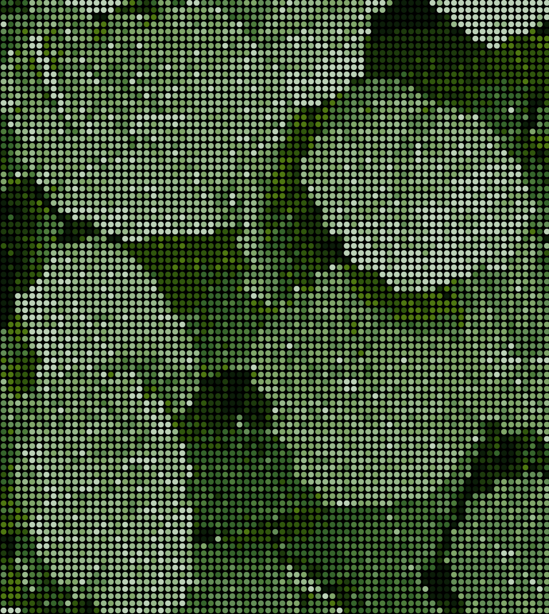
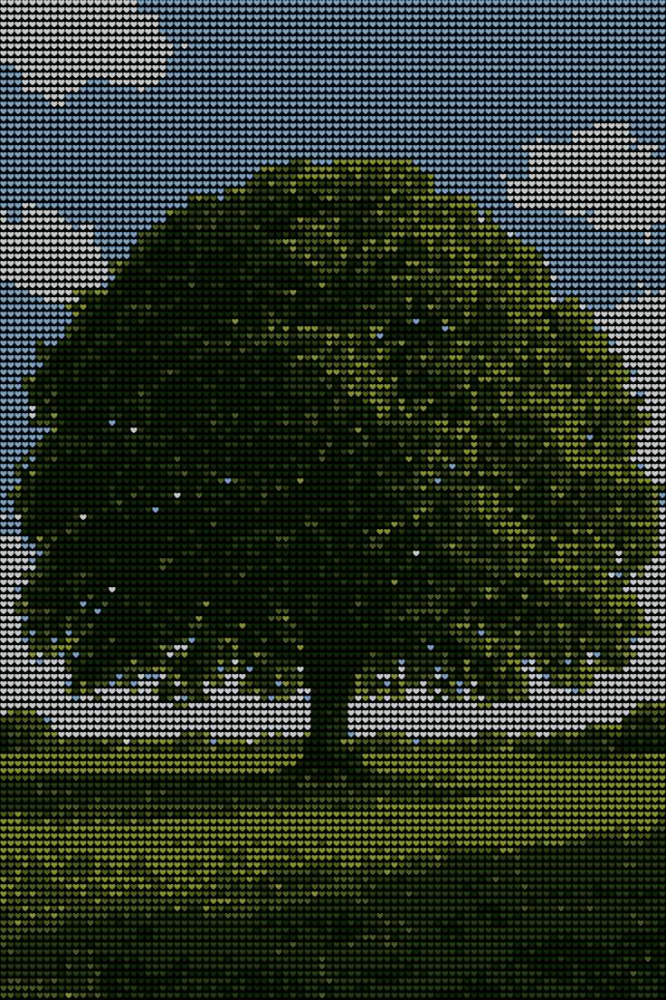

# Wither-Dither

Wither-Dither is a browser-based tool that transforms images and videos into colorful, ASCII-styled dithering art rendered directly on an HTML canvas.
It automatically extracts dominant colors, supports live re-rendering, and allows downloads of the final result as an image (.png) or video (.webm / .mp4).

# Features

- Upload images or videos directly from your device

- Automatic color palette extraction using a clustering-based algorithm

- Adjustable parameters:

- Grid size

- Number of colors

- Character style

- Randomized dithering mode

- Color refresh interval for videos

- Export as .png (images) or .webm / .mp4 (videos)

- Runs completely in the browser

## No Dithering

## Dithering

# How It Works

1. The uploaded image or video is drawn to a canvas element.

2. A color quantization algorithm extracts the most representative colors from the frame.

3. Each pixel block is replaced with colored text characters to form a dithered representation.

4. For videos, each frame is rendered in real time, and the process can be recorded and saved automatically.

# Try it out

+ Run a simple local web server. For example, with xampp:

  [XAMPP](https://www.apachefriends.org/de/index.html)

+ Upload an image or video file and adjust the settings using the available controls.

# Output

+ Images are saved as: filename_wither-dither.png

+ Videos are saved as: filename_wither-dither.webm or converted to .mp4

# Gallery

# Author

Ben Zimmermann

inspired by:

[Radu Mariescu-Istodor](https://www.youtube.com/watch?v=juIFchliumI&t=903s)

"High resolution videos might buffer or lag. Try a lower resolution or fewer colors for smoother playback."

If you copy this code, credit me - or I will haunt you in your dreams!
